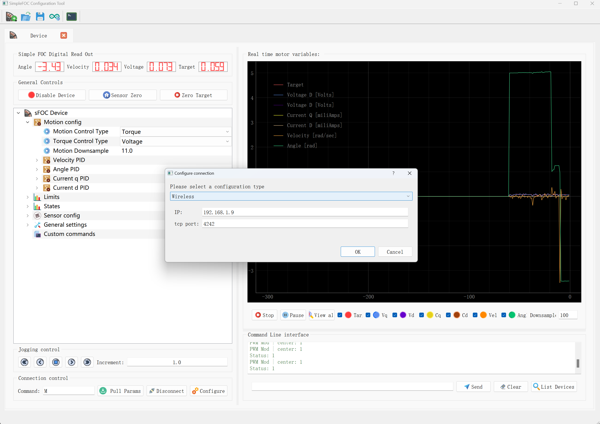

# WirelessTuning

I have added wireless tuning functionality to [SimpleFOC Studio](https://github.com/SmallPond/SimpleFOCStudio) and am attempting to merge it into the upstream. Correspondingly, we need to redirect the outputs of the Simple FOC Commander and Monitor to the Wireless interface on the Arduino side.

WirelessTuning supports wireless parameter tuning for SimpleFOC and can act as glue code between the Commander and Monitor. This requires no modifications to any code in SimpleFOC.

WirelessTuning encapsulates and implements a stream class that uses TCP for data transmission and reception.



```cpp


BLDCMotor motor = BLDCMotor(7);
BLDCDriver3PWM driver = BLDCDriver3PWM(MO0_1, MO0_2, MO0_3);

WirelessTuning wireless = WirelessTuning(4242);
Commander commander = Commander(wireless, '\n', false);


void setup()
{
    motor.useMonitoring(wireless);
    wireless.begin(ssid, passwd);
}


void loop()
{
    commander.run();
    motor.monitor();
}


```